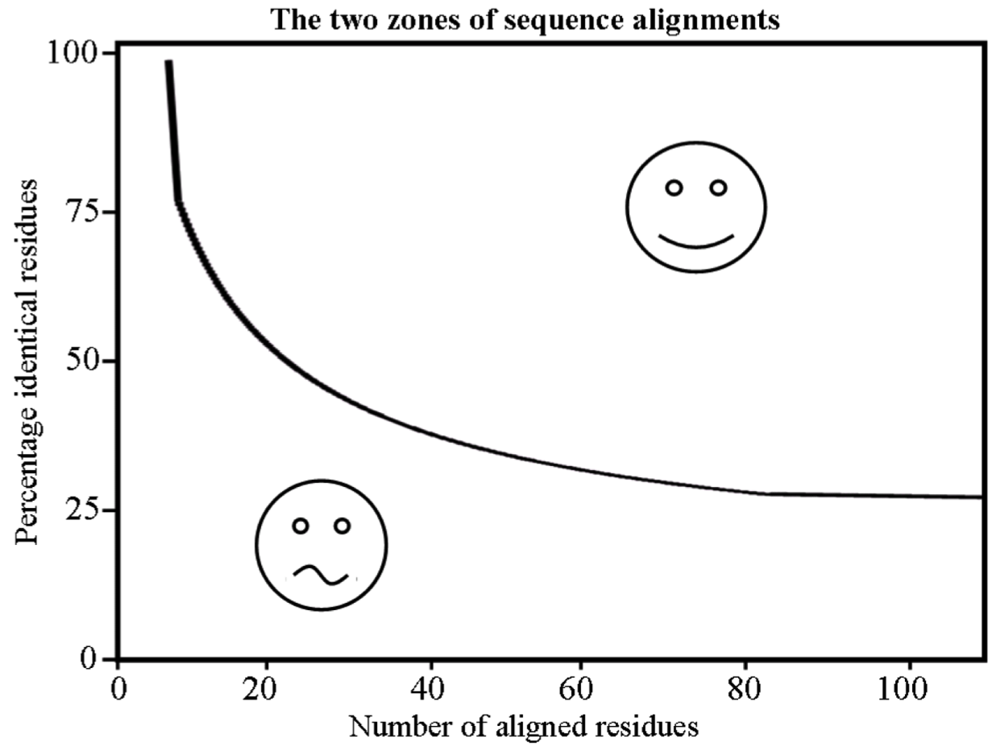
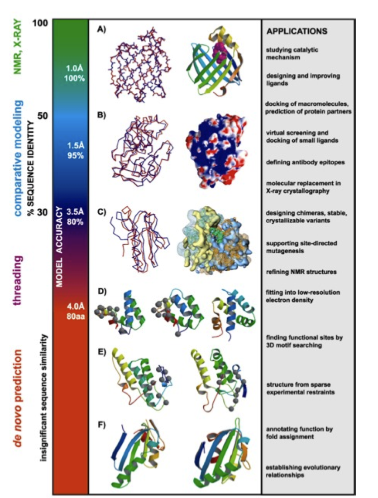

###Homology Modelling

In this tutorial we will see how to build the homology model of Gadd45β. 

Let's start with some introduction on the three-dimensional (3D) structure of proteins. 
Where can we find the spatial coordinates of biological macromolecules? 

The Protein Data Bank ([PDB](http://www.rcsb.org)) is the major resource for macromolecular structures. This resource archives information about the 3D shapes of proteins, nucleic acids, and complex assemblies.

![pdb homepage] (img/pdb_homepage.png)

A text file contains both meta information (annotation) lines and coordinate lines (starting by "ATOM").

![pdb textfile] (img/pdb_textfile.png)

In most of the cases, the structure of proteins has not yet been determined and X-ray and NMR experiments are *expensive* and time demanding. 

* 549,832 (SwissProt) + 54.540.801 (TrEMBL) Nov 2015
* 114.080 (PDB), 28244 unique(<30% SeqId), Nov 2015
* The difference between the number of sequences and structures is growing

What can we do when the coordinates of a protein are not available in the PDB? 

Computational approaches

* Fast (minutes/hours), cheap (PC)
* Correct solutions in ~60% of cases
* Low risolution but often sufficient to many purposes

Is it possible to predict a protein structure from its sequence? 

###Homology modelling

Homology modelling is a procedure to predict the 3D structure of a protein. It relies on a few principles:

* The structure of a protein is uniquely determined by its amino acid
* Therefore the sequence should, in theory, contain enough information to obtain the structure 
* Similar sequences have been found to adopt practically identical structures while distantly related sequences can still fold into similar structures

Chothia et al. 1986; Sander et al. 1991; Rost 1999

The predictive methods to adopt strongly depend on the percentage of sequence identity between the protein of unknown structure ("target") and a protein with known structure ("template").

*Comparative modeling                      > 30% identity
*Threading/Fold recognition                0 – 30% identity
*Ab initio/de novo                         no homologous

The percentage of sequence identity also affects the quality of the final model and, therefore, of the studies you can carry out with the model.

sequence identity|model quality
:-----------------:|--------------
60-100%          |Comparable with average resolution NMR. Substrate specificity
30-60%           |Starting point for site-directed mutagenesis studies
< 30%            | Serious errors

####Homology modelling basically consists of 8 steps

1. Template recognition and initial alignment 
2. Alignment correction 
3. Backbone generation 
4. Loop modeling 
5. Side chain modelling 
6. Model optimisation 
7. Model validation (by hand or using different servers)
8. Iteration to correct mistakes (if any)

![steps homology modelling] (img/steps_homology_modelling.png) 

###Step 1: Template recognition and initial alignment 
* To identify the template, the program compares the query sequence to all the sequences of known structures in the PDB (e.g. BLAST)
* Usually, the template structure with the highest sequence identity and coverage will be the first option
* Other considerations:
* conformational state (i.e. active or inactive) 
* present co-factors
* other molecules or multimeric complexes
* It is possible to choose multiple templates and build multiple models 
* It is possible to combine multiple templates into one structure that is used for modeling 

###Step 2: Alignment correction
Having identified one or more possible modeling templates using the initial screen described above, more sophisticated methods are needed to arrive at a better alignment 

###Step 3: Backbone generation 
* When the alignment is ready, the actual model building can start 
* Creating the backbone is trivial for most of the model: one simply transfers the coordinates of those template residues that show up in the alignment with the model
* If two aligned residues differ, the backbone coordinates for N, Cα, C and O and often also the Cβ can be copied
* Conserved residues can be copied completely to provide an initial guess 

###Step 4: Loop modeling  
* For the majority of homology model building cases, the alignment between model and template sequence contains gaps 
* Gaps in the model-sequence are addressed by omitting residues from the template 
* Gaps in the template sequences are treated by inserting missing residues the into the continuous backbone 
* Changes in loop conformation are notoriously hard to predict 

Loop modelling

A search is made through the PDB for known loops containing endpoints that match the residues between which the loop is to be inserted. 

 

 ---> 

=======

2. Homology model of Gadd45β
a) First, we have to identify the protein sequence of Gadd45β. Go to UniProt (http://www.uniprot.org), type the Gadd45β UniProt AC (O75293) in the text box at the top and click on Search. On the result page, go to the sequence information (you can scroll-down until you reach the Sequence section or directly click on the "Sequence" link on the left). Click on the FASTA link and copy the sequence in FASTA format. 
b) Second, we have to identify a suitable template for Gadd45β. Go to HHPred and paste the Gadd45β in FASTA format into the Input text box. Inspect all the Search Options (but keep the default ones).
In the "Job Options" section, specify a Job-ID (e.g. gadd45B). Then Submit your job. The run may last up to a few minutes. However, this Gadd45β is a small protein (160 aa) and the template search should be quite fast.
c) In the HHpred result page, inspect the proposed templates. Which is the best one? Why? Go to the alignment between Gadd45β and its best template and take sometime to inspect it. Is it reliable? Do you think it might be manually improved? Has it a good coverage? What is the sequence identity? What is the e-value? Are the values of these two parameters good enough to proceed with the model building?
c) Once you are satisfied with the best template inspection, select it, then click on the "Create model" link immediately below the "Result, Histogram, etc." menu bar. In the resulting page, check whether the selected best template is the one that you actually selected, then click on the "Create model from manually selected template(s)" button.
d) You will end up in the "Modeller" page.  The target-template alignment will appear in the Input text box ("Paste multiple alignment"). Notice that, if you want to run a local version of Modeller, you have to copy this alignment and paste it to a local text file with .ali extension. This is NOT what we are going to do here. Here, we will use the Modeller installation provided by The Bioinformatics Toolkit. Therefore, check the options and insert a MODELLER-key (you can use "modeliranje") and a name for your Job in the Job-ID text box (I suggest "gadd45B_model" or something similar). Then, Submit your Job.
e) Congratulations! You have built a model for Gadd45β. You can Save it now. 
f) After downloading it, open the file with your favourite Text Editor (gedit, vim, pico, nano, etc) and take a few minutes to inspect the file.
g) Before going back to the prediction of the Gadd45β-MKK7 complex, we will spend a few minutes to check the quality of our model. 
Go to the QMEAN Server for Model Quality Estimation (http://swissmodel.expasy.org/qmean/cgi/index.cgi), provide a name for your project (I suggest gadd45B_model_quality) and upload the gadd45B_model.pdb file and submit your job. Notice that the quality assessment may take some time. We will discuss the result of the QMEAN run later.
